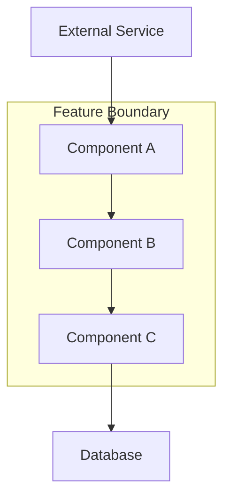
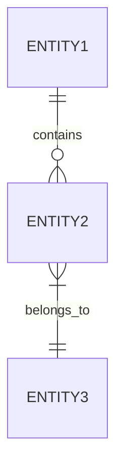

# Design Phase

## Overview

Create a comprehensive technical design document based on approved requirements, including architecture, components, data models, and testing strategy.

## Prerequisites

- Requirements document must exist and be **approved**
- Read `.specflow/project.md` for project conventions and patterns
- Read `.specflow/specs/active/{feature_name}/requirements.md` before starting
- Check `.specflow/specs/completed/` for related specs that can provide context

## Document Location

Create `.specflow/specs/active/{feature_name}/design.md`

---

## Step 1: Research Process

Before writing the design, gather necessary context:

1. **Identify research needs** based on requirements
2. **Conduct research** and build context in conversation
3. **Summarize key findings** that inform design decisions
4. **Cite sources** and include relevant links
5. Do **NOT** create separate research files

### Research Areas to Consider

- Existing codebase patterns and conventions
- Third-party library options and trade-offs
- Industry best practices for similar features
- Security considerations and compliance requirements
- Performance benchmarks and scalability patterns

---

## Step 1b: Design Grilling (Optional)

Appropriate when the feature involves architectural choices with real trade-offs. Analyze the requirements and surface the decisions that would most change the design if answered differently. Present as a single block, each with your recommendation and reasoning.

### What to Look For

- **Data model forks** — choices in table structure or relationships that are hard to change later
- **Coupling decisions** — whether components should call each other directly or go through an event/queue
- **Consistency vs. availability trade-offs** — especially where concurrent writes are possible
- **API shape** — choices in endpoint design that affect the client contract
- **Ownership and access** — who can read/write each resource, and how that maps to the data model

**Example (billiard booking with Laravel + React):**

```
1. Booking status flow
   My proposed states: pending → confirmed → completed / cancelled.
   Payment triggers confirmed. Should there be a "held" state during checkout,
   or does the booking only exist post-payment?

2. Table-level locking strategy
   My recommendation: optimistic locking with a unique constraint on (table_id, slot_start).
   The DB rejects the second insert; the API returns a 409. Simpler than a queue-based hold,
   but means no "soft reservation" during payment. Acceptable?

3. Admin vs. user data separation
   The admin interface is Laravel; the user interface is React calling the same API?
   Or are these two separate backends?
   My assumption: one Laravel backend, two frontends (React SPA + Laravel Blade admin).
```

After the user confirms, generate design.md using the agreed decisions. Capture confirmed choices in the Design Decisions table with the reasoning stated here.

---

## Step 2: Document Structure

### Complete Template

```md
# Feature Design: [Feature Name]

## Overview

[2-3 paragraphs covering:]
- What this design accomplishes
- Key technical decisions made
- How it addresses the requirements

---

## Architecture

### System Context

[Describe where this feature fits in the overall system]

### High-Level Architecture

[Description of the architectural approach]



### Design Decisions

| Decision | Options Considered | Choice | Rationale |
|----------|-------------------|--------|-----------|
| [Decision 1] | Option A, Option B | Option A | [Why this choice] |
| [Decision 2] | Option X, Option Y | Option Y | [Why this choice] |

---

## Components and Interfaces

### Component 1: [Name]

**Purpose:** [What this component does]

**Responsibilities:**
- [Responsibility 1]
- [Responsibility 2]

**Interface:**
```
ComponentName:
  method1(param: Type) -> ReturnType
  method2(param: Type) -> ReturnType
```

**Dependencies:**
- [Dependency 1]: [Why needed]
- [Dependency 2]: [Why needed]

---

### Component 2: [Name]

**Purpose:** [What this component does]

**Responsibilities:**
- [Responsibility 1]
- [Responsibility 2]

**Interface:**
```
ComponentName:
  // Define methods and signatures
```

---

## Data Models

### Entity 1: [Name]

```
EntityName:
  id: string (UUID)
  field1: string
  field2: number
  created_at: datetime
  updated_at: datetime
```

**Field Descriptions:**
| Field | Type | Constraints | Description |
|-------|------|-------------|-------------|
| id | string | UUID, required | Unique identifier |
| field1 | string | max 255 chars | [Description] |
| field2 | number | >= 0 | [Description] |

### Relationships



---

## API Design (if applicable)

### Endpoint 1: [Method] [Path]

**Purpose:** [What this endpoint does]

**Request:**
```json
{
  "field1": "value",
  "field2": 123
}
```

**Response (200):**
```json
{
  "id": "uuid",
  "field1": "value",
  "createdAt": "2024-01-01T00:00:00Z"
}
```

**Error Responses:**
| Status | Code | Description |
|--------|------|-------------|
| 400 | VALIDATION_ERROR | Invalid input data |
| 404 | NOT_FOUND | Resource not found |
| 500 | INTERNAL_ERROR | Server error |

---

## Error Handling

### Error Categories

| Category | Handling Strategy | User Impact |
|----------|-------------------|-------------|
| Validation Errors | Return 400 with field-specific messages | Show inline errors |
| Not Found | Return 404, log warning | Show friendly "not found" page |
| Authorization | Return 403, audit log | Redirect to appropriate page |
| Server Errors | Return 500, alert on-call, log full details | Show generic error, offer retry |

### Error Recovery

- [Describe retry strategies]
- [Describe fallback behaviors]
- [Describe graceful degradation]

---

## Testing Strategy

### Unit Tests

| Component | Test Focus | Coverage Target |
|-----------|-----------|-----------------|
| [Component 1] | [What to test] | 80%+ |
| [Component 2] | [What to test] | 80%+ |

### Integration Tests

- [Test scenario 1]: [Description]
- [Test scenario 2]: [Description]

### E2E Tests

- [User flow 1]: [Description]
- [User flow 2]: [Description]

---

## Security Considerations

- [Security consideration 1]
- [Security consideration 2]
- [Data privacy handling]

---

## Performance Considerations

- [Expected load and capacity]
- [Caching strategy]
- [Database query optimization]

---

## Requirements Traceability

| Requirement | Design Component | Notes |
|-------------|------------------|-------|
| Req 1.1 | Component A, Data Model X | [Notes] |
| Req 1.2 | Component B | [Notes] |
| Req 2.1 | API Endpoint Y | [Notes] |
```

---

## Step 3: Review Process

After creating/updating design:

1. **Present the document** with summary of key decisions
2. **Ask explicitly:** "Does the design look good? If so, we can move on to the implementation plan."
3. **Handle feedback:**
   - Make requested modifications
   - Ask for approval again after each iteration
4. **Only proceed** to Tasks phase after explicit approval

### Design Review Checklist

- [ ] All requirements are addressed
- [ ] Architecture is clearly explained
- [ ] Interfaces are well-defined
- [ ] Data models are complete
- [ ] Error handling is comprehensive
- [ ] Testing strategy covers all components
- [ ] Security considerations are addressed

